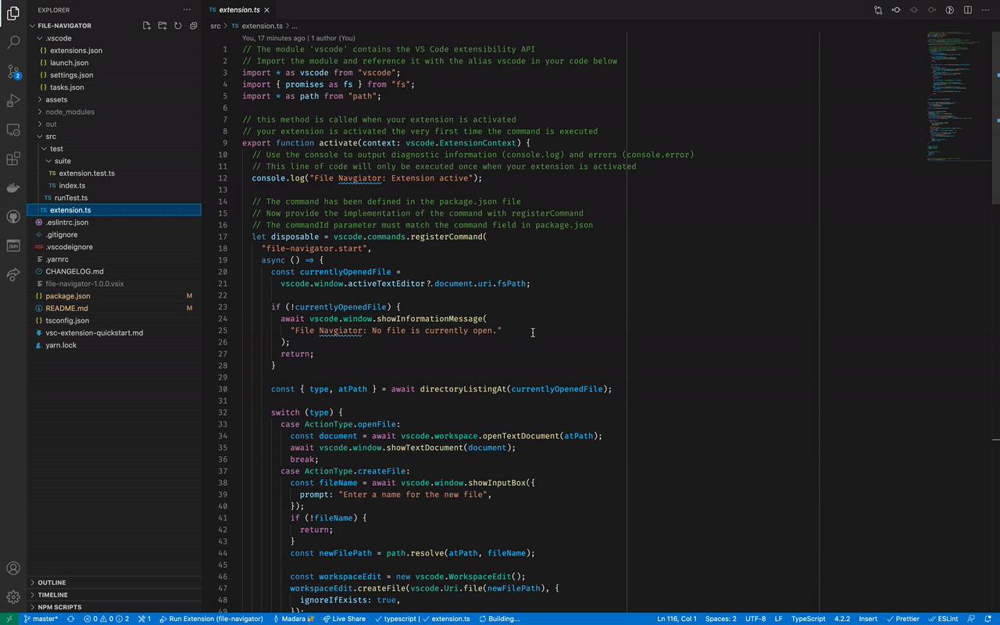

# file-navigator

File Navigator is a VSCode extension that enables simple file navigation through the VSCode menus.

## Features

- Single command, open from the context menu or with the default keybind, `CTRL+L` (`CMD+L` on Mac)
- Intuitively search for files out of the directory listing
- Select `..` to go up one folder

## Release Notes

### 1.0.0

Initial release of file-navigator
